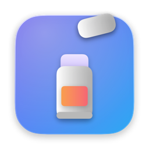
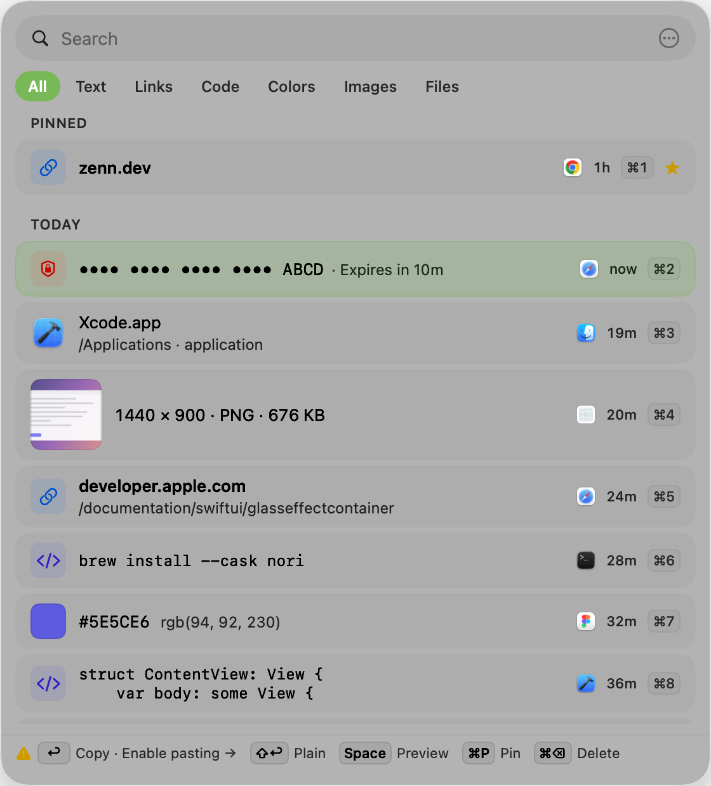

<p align="center">
  
</p>

<h1 align="center">Nori</h1>

<p align="center">
  A clipboard history for macOS 26 that shows every copy as what it is.<br>
  <em>糊（のり）= paste. Built from scratch, inspired by <a href="https://github.com/p0deje/Maccy">Maccy</a>.</em>
</p>

<p align="center">
  <a href="https://github.com/hocky0301/Nori/actions/workflows/ci.yml"></a>
  <a href="https://github.com/hocky0301/Nori/releases/latest"></a>
  
  
  <a href="LICENSE"></a>
</p>

<p align="center">
  
</p>

## What it does

Press **⌘⇧V** anywhere. A glass panel opens at your pointer with everything you have copied — text, links, code, colors, images, files — each rendered as its own kind of card. Type to search, press **↩** to paste into the app you were just using, done.

- **Typed cards.** Links show their host, code is set in monospace, colors get a swatch, images a thumbnail, files their Finder icon. Filter by kind with one keystroke (Tab).
- **One action grammar, printed live.** ↩ pastes. ⇧ adds *plain text*, ⌥ adds *keep the panel open*, ⌘ means *copy only*. The hint bar at the bottom rewrites itself the moment you hold a modifier, so the shortcut you are about to press is always on screen.
- **Stable numbers.** Pinned clips sit first and keep their ⌘1…⌘n forever.
- **Visible privacy.** Anything that looks like a secret (API keys, tokens, private keys, card numbers) is masked, kept in memory only and forgotten after ten minutes. Copies from password managers are never recorded. When something was deliberately not saved, a small ghost row tells you why.
- **Honest permissions.** Nori pastes by pressing ⌘V for you, which needs Accessibility. Until you grant it, ↩ visibly becomes *Copy* and the first hint chip is the fix.
- **Nothing leaves your Mac.** No network code at all. History lives in `~/Library/Application Support/Nori`.

<!-- screenshots grid -->

## Install

Requires **macOS 26 Tahoe** or later.

1. Download `Nori-x.y.z.zip` from the [latest release](https://github.com/hocky0301/Nori/releases/latest) and move `Nori.app` to `/Applications`.
2. The build is ad-hoc signed (no Apple Developer ID yet), so clear the quarantine flag once:
   ```bash
   xattr -d com.apple.quarantine /Applications/Nori.app
   ```
3. Launch Nori. The welcome flow lets you pick the hotkey and grant **Accessibility** (System Settings › Privacy & Security), which is what lets Nori paste for you.

Or build it yourself:

```bash
brew install xcodegen
git clone https://github.com/hocky0301/Nori.git && cd Nori
xcodegen generate && open Nori.xcodeproj   # or: scripts/release.sh
```

## Keyboard

| Key | Action |
|---|---|
| ⌘⇧V | Open / close Nori (changeable in Settings) |
| hold ⌘⇧, tap V again | Step through clips; release to paste |
| type | Search (any order of words; secrets are never indexed) |
| ↩ | Paste the selected clip |
| ⇧↩ · ⌥↩ · ⌘↩ | Paste as plain text · paste and keep Nori open · copy only |
| ⌘1 … ⌘9 | Paste clip n (⇧ / ⌥ stack) |
| ↑ ↓ · ⌘↑ ⌘↓ | Move · jump to first / last |
| Tab / ⇧Tab | Next / previous filter chip |
| Space · ⌘Y | Expand the selected card inline |
| ⌘P | Pin / unpin |
| ⌘⌫ · ⌘Z | Delete · undo delete |
| ⌘O · ⌘R | Open link / file · reveal file in Finder |
| ⌘⇧P | Pause capture |
| ⌘, | Settings |
| Esc | Close |

Mouse: hover selects, click pastes, ⇧/⌥/⌘-click add the same bits, right-click shows every chord.

## Privacy model

| What | Behaviour |
|---|---|
| `org.nspasteboard.ConcealedType` (password managers) | Never saved; a ghost row says *"Concealed item from 1Password wasn't saved"* |
| `TransientType`, `AutoGeneratedType` | Ignored silently |
| Copies from 1Password, Bitwarden, KeePassXC, Keychain Access, Passwords, Dashlane | Ignored (editable list) |
| Private keys, AWS / GitHub / OpenAI / Slack / Google keys, JWTs, Luhn-valid card numbers | Masked, memory only, expire after 10 min, never searchable, never pinnable |
| Pause | 5 min / 30 min / until resumed, from the menu bar icon or ⌘⇧P |
| Storage | Unencrypted SwiftData store in your user library; images stored as PNG only, capped at 10 MB (configurable) |

## How it works (the interesting bits)

- **There is no clipboard notification on macOS.** Nori polls `NSPasteboard.general.changeCount` every 200 ms, freezes the pasteboard into a value (`PasteboardSnapshot`), and runs a pure, unit-tested decision function over it — privacy markers on the *union* of types, multi-item merges, Word bookmark stripping, size caps, secret detection — before anything touches the database.
- **Pasting from a panel that never activates.** The panel is a non-activating `NSPanel`: it owns the keyboard while open, but the app you came from stays frontmost. On ↩ Nori closes the panel, writes the clip to the pasteboard, and posts a synthetic ⌘V whose key code is found by walking `UCKeyTranslate` on the ⌘ layer of the *current* keyboard layout (JIS, AZERTY, Dvorak-QWERTY⌘ all work).
- **One grammar, two consumers.** `ActionGrammar.resolve(base, bits, capabilities)` decides what a key does; the hint bar and the context menu render from the same function, so what is printed on screen is by construction what happens.
- **Liquid Glass, once.** The panel is the only glass surface; cards, chips and keycaps are flat fills over it, which keeps 500 rows scrolling at full frame rate.

A longer write-up (in Japanese) is on Zenn: <!-- zenn link -->

## Development

```bash
xcodegen generate                       # project.yml → Nori.xcodeproj
scripts/dev-build.sh test               # build + unit tests, noise filtered
scripts/dev-drive.sh launch --seed-demo # in-memory instance with demo clips
scripts/dev-drive.sh cmd open-center    # drive it from the terminal (DEBUG builds only)
scripts/dev-drive.sh shot out.png       # screenshot the panel
```

Swift 6 with strict concurrency, SwiftUI + AppKit, SwiftData. The only dependency is [KeyboardShortcuts](https://github.com/sindresorhus/KeyboardShortcuts).

## Credits

Nori is a from-scratch app, but it would not exist without [Maccy](https://github.com/p0deje/Maccy) by Alexey Rodionov: its source is where the edge cases of macOS clipboard management are documented in code.

MIT © 2026 Kamil Ijuin
